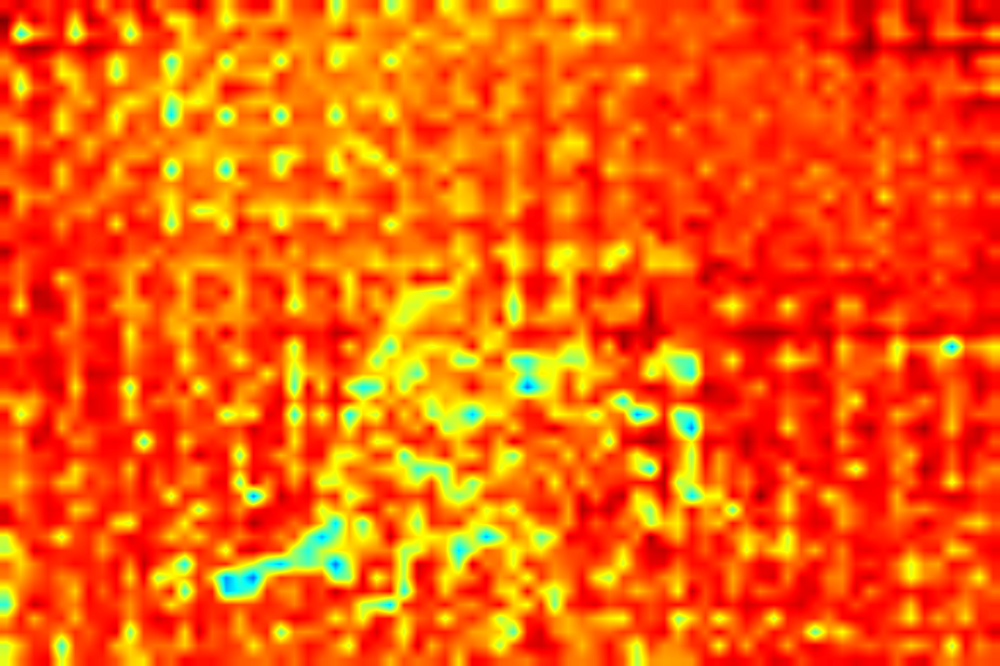

# Smooth Grad-CAM for Qwen2.5-VL

<table>
  <tr>
    <td align="center">
      
      <br/>
      <b>Original Image</b>
    </td>
    <td align="center">
      
      <br/>
      <b>Grad-CAM Heatmap</b>
    </td>
    <td align="center">
      
      <br/>
      <b>Grad-CAM Superimposed Result</b>
    </td>
  </tr>
</table>


A visual attention visualization tool for Vision-Language models based on SmoothGrad and Grad-CAM, specifically optimized for Qwen2.5-VL models.

> **Note**: This implementation is based on the work from [From-Redundancy-to-Relevance](https://github.com/zhangbaijin/From-Redundancy-to-Relevance/tree/master), adapted for Qwen2.5-VL models.

## 📋 Table of Contents

- [Features](#features)
- [Installation](#installation)
- [Quick Start](#quick-start)
- [Usage Guide](#usage-guide)
- [API Documentation](#api-documentation)
- [Visualization Modes](#visualization-modes)
- [Technical Details](#technical-details)
- [FAQ](#faq)
- [Acknowledgments](#acknowledgments)

## ✨ Features

- **Smooth Grad-CAM Implementation**: Generate more stable and accurate attention heatmaps through noise-averaged sampling
- **Multi-layer Visualization**: Support simultaneous visualization of attention patterns across multiple Transformer layers
- **Flexible Visualization Modes**:
  - Single layer detailed analysis
  - Multi-layer grid comparison
  - Layer progression analysis (early/middle/late)
  - Custom layer selection
- **Non-square Grid Support**: Intelligent handling of visual token grids of various sizes
- **Batch Processing**: Efficient multi-layer visualization processing

## 📦 Installation

### Dependencies

```bash
pip install torch transformers pillow opencv-python numpy matplotlib
```

### Requirements

- Python >= 3.8
- PyTorch >= 2.0
- Transformers >= 4.35
- CUDA recommended (CPU supported but slower)

### Model Setup

Download Qwen2.5-VL model:

```bash
# Using Hugging Face CLI
huggingface-cli download Qwen/Qwen2.5-VL-3B-Instruct --local-dir /path/to/model

# Or using Python
from transformers import AutoModel, AutoProcessor
model = AutoModel.from_pretrained("Qwen/Qwen2.5-VL-3B-Instruct")
processor = AutoProcessor.from_pretrained("Qwen/Qwen2.5-VL-3B-Instruct")
```

## 🚀 Quick Start

### Basic Usage

```python
from smooth_gradcam import SmoothQwenGradCAM, get_model_layers
from transformers import Qwen2_5_VLForConditionalGeneration, AutoProcessor
from PIL import Image

# Load model
model = Qwen2_5_VLForConditionalGeneration.from_pretrained(
    "path/to/Qwen2.5-VL-3B-Instruct",
    torch_dtype="auto",
    device_map="auto"
)
processor = AutoProcessor.from_pretrained("path/to/Qwen2.5-VL-3B-Instruct")
model.eval()

# Get target layer
layers, total_layers = get_model_layers(model)
target_layer = layers[-1]  # Use last layer

# Create Grad-CAM object
grad_cam = SmoothQwenGradCAM(
    model=model,
    processor=processor,
    target_layer=target_layer,
    num_samples=10,  # SmoothGrad sampling count
    noise_std=0.15   # Noise standard deviation
)

# Load image and generate CAM
image = Image.open("demo.jpeg").convert("RGB")
prompt = "Describe the main content in this image in detail."

superimposed_image, heatmap = grad_cam.generate_cam(image, prompt)
```

### Using Test Script

```bash
# Basic usage - Grid visualization
python test_gradcam.py \
    --model_path /path/to/model \
    --image_path demo.jpeg \
    --mode grid

# Single layer visualization
python test_gradcam.py \
    --model_path /path/to/model \
    --image_path demo.jpeg \
    --mode single \
    --layer 27

# Multi-layer comparison
python test_gradcam.py \
    --model_path /path/to/model \
    --image_path demo.jpeg \
    --mode multi \
    --layers 6 12 18 27

# Progressive comparison
python test_gradcam.py \
    --model_path /path/to/model \
    --image_path demo.jpeg \
    --mode comparative
```

## 📖 Usage Guide

### Visualization Modes

#### 1. Single Layer Mode
Visualize attention patterns of a single Transformer layer for in-depth analysis.

```python
from test_gradcam import single_layer_visualization

single_layer_visualization(
    model, processor, image, prompt,
    layer_idx=27,  # Layer index
    num_samples=10,  # SmoothGrad samples
    noise_std=0.15,  # Noise intensity
    save_dir="results/single"
)
```

#### 2. Grid Mode
Display CAM results from multiple layers in a grid for quick comparison.

```python
from visualization_utils import create_layer_comparison_grid

results = create_layer_comparison_grid(
    model, processor, image, prompt,
    layer_range="auto",  # Options: "auto", "early", "middle", "late", "all", or list
    save_dir="results/grid"
)
```

Layer range options:
- `"auto"`: Automatically select 6 representative layers
- `"early"`: First 1/3 of layers
- `"middle"`: Middle 1/3 of layers
- `"late"`: Last 1/3 of layers
- `"all"`: All layers (may be slow)
- `[0, 5, 10, 15]`: Custom layer list

#### 3. Multi-layer Mode
Generate detailed multi-layer comparison with heatmaps and overlays.

```python
from visualization_utils import visualize_multiple_layers

results = visualize_multiple_layers(
    model, processor, image, prompt,
    layer_indices=[6, 12, 18, 27],  # Specify layers to visualize
    save_dir="results/multilayer"
)
```

#### 4. Comparative Mode
Generate comparative analysis of early, middle, and late layers.

```python
from visualization_utils import create_comparative_analysis

results = create_comparative_analysis(
    model, processor, image, prompt,
    save_dir="results/comparative"
)
```

### Parameter Tuning

#### SmoothGrad Parameters
- **num_samples** (default 10): More samples = smoother results but slower
  - Quick preview: 3-5
  - Standard quality: 10
  - High quality: 20-50

- **noise_std** (default 0.15): Noise standard deviation controls perturbation strength
  - Low noise (0.05-0.1): Closer to original Grad-CAM
  - Medium noise (0.1-0.2): Balance between smoothness and detail
  - High noise (0.2-0.3): Smoother but may lose details

## 🔧 API Documentation

### Core Classes

#### SmoothQwenGradCAM

Main Grad-CAM implementation class.

```python
class SmoothQwenGradCAM:
    def __init__(self, model, processor, target_layer, num_samples=10, noise_std=0.1):
        """
        Args:
            model: Qwen2.5-VL model instance
            processor: Corresponding processor
            target_layer: Target layer to visualize
            num_samples: SmoothGrad sampling count
            noise_std: Noise standard deviation
        """

    def generate_cam(self, image: Image.Image, prompt: str, use_smooth=True):
        """
        Generate CAM heatmap.

        Args:
            image: PIL image
            prompt: Text prompt
            use_smooth: Whether to use SmoothGrad

        Returns:
            tuple: (superimposed image, heatmap)
        """
```

### Utility Functions

#### get_model_layers
```python
def get_model_layers(model):
    """
    Get all layers from the model.

    Returns:
        tuple: (layer list, total layer count)
    """
```

#### create_layer_comparison_grid
```python
def create_layer_comparison_grid(model, processor, image, prompt,
                                layer_range="auto", save_dir="cam_results_grid"):
    """
    Create layer comparison grid.

    Args:
        layer_range: Layer selection strategy
        save_dir: Save directory

    Returns:
        dict: CAM results for each layer
    """
```

## 🔬 Technical Details

### Grad-CAM Principle

Grad-CAM (Gradient-weighted Class Activation Mapping) generates visual explanations by analyzing gradients of the target class with respect to feature maps:

1. **Forward Pass**: Obtain feature maps from target layer
2. **Backward Pass**: Calculate gradients of target score with respect to feature maps
3. **Weighted Combination**: Use globally pooled gradients as weights
4. **ReLU Activation**: Keep only positive activations

### SmoothGrad Enhancement

SmoothGrad reduces noise by adding noise to input images and averaging results from multiple runs:

```
CAM_smooth = 1/n * Σ CAM(image + noise_i)
```

This approach:
- Reduces random noise
- Highlights stable attention patterns
- Provides more reliable visualizations

### Visual Token Processing

Qwen2.5-VL uses special tokens `<|vision_start|>` and `<|vision_end|>` to mark visual content. This implementation automatically:

1. Locates visual token range
2. Extracts corresponding features and gradients
3. Handles non-square grids (e.g., 49×73)

## ❓ FAQ

### Q: Why do some layers' heatmaps look blurry?
A: Early layers typically focus on low-level features (edges, textures), while later layers focus on high-level semantics. Try adjusting the noise_std parameter.

### Q: How to choose the best layer for visualization?
A: It's recommended to first use "auto" or "grid" mode to view multiple layers, then select the most informative layers for detailed analysis.

### Q: Processing is too slow. What can I do?
A:
- Reduce num_samples (e.g., set to 3-5)
- Use fewer layers
- Ensure GPU usage
- Consider using smaller models (e.g., 3B version)

### Q: How are non-square visual token counts handled?
A: The code automatically finds the nearest factor pairs to reshape the grid. For example, 3577 tokens would be reshaped to 49×73.

## 🙏 Acknowledgments

This project is built upon the excellent work from:
- [From-Redundancy-to-Relevance](https://github.com/zhangbaijin/From-Redundancy-to-Relevance/tree/master) - Original implementation and methodology

## 📝 Citation

If you use this code in your research, please cite:

```bibtex
@software{smooth_gradcam_qwen,
  title = {Smooth Grad-CAM for Qwen2.5-VL},
  author = {Chuanyu Qin},
  year = {2024},
  url = {https://github.com/cyuQ1n/smooth-gradcam-qwen}
}

@article{from_redundancy_to_relevance,
  title = {From Redundancy to Relevance: Enhancing Explainability in Multimodal Large Language Models},
  author = {Zhang, Baijin and others},
  year = {2024},
  url = {https://github.com/zhangbaijin/From-Redundancy-to-Relevance}
}
```

## 📄 License

This project is licensed under the MIT License. See [LICENSE](LICENSE) file for details.

## 🤝 Contributing

Contributions, issue reports, and suggestions are welcome! Please participate through GitHub Issues or Pull Requests.

## 👥 Credits

- **Author**: Chuanyu Qin
- **Original Reference**: [From-Redundancy-to-Relevance](https://github.com/zhangbaijin/From-Redundancy-to-Relevance)

## 📧 Contact

For questions or collaboration opportunities, please contact: [qincyu21@163.com]